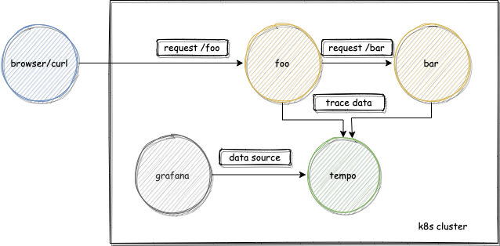

## foobar

This is a distributed tracing demo! Foobar consists of two **extremely** complex services: foo and bar.

On this demo:
- You can generate load with k6.
- Services foo and bar:
  - Are written in Python.
  - Are instrumented with OpenTelemetry.
  - Export the spans to an OpenTelemetry Collector using the OTLP exporter.
- The OpenTelemetry Collector exports the tracing data to Grafana Tempo.
- Grafana Tempo can be queried from Grafana.

Here's a small diagram:
<p align="center">

</p>

## QuickStart

Requirements: k8s cluster with tempo, loki and grafana installed

1. Build and run services

2. Deploy services to your k8s cluster as deployment:
```
kubectl apply -f ./k8s/foobar.yaml
```

3. Generate some load with attached shell script. This assumes you have portforwarding enabled for the foo app on port 9091
```
sh gen_trace.sh
```

4. See logs with:
```
kubectl logs -f <foo-pod-name> | grep trace_id
```
